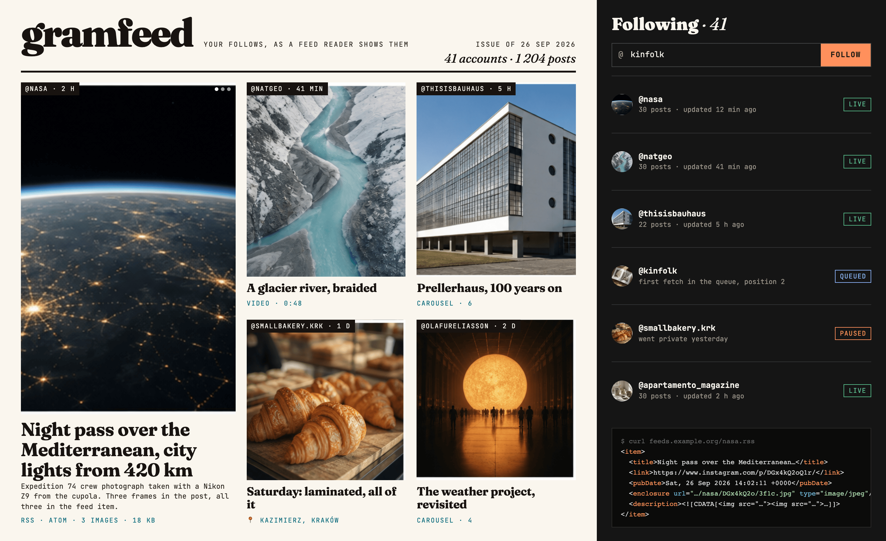

# gramfeed

**Instagram accounts as RSS feeds, on a server you own.**

Follow a public account in the admin, get a feed URL, put it in Feedly, NetNewsWire, Miniflux or anything else. Photos, carousels and videos show inline; captions, locations and dates come along. No app, no algorithm, no ads between the posts.



## How it works

1. You follow `@natgeo` in the admin. A job is queued.
2. A worker fetches the profile's recent posts with **instaloader**, copies every image and video to your **S3** bucket (Instagram's CDN links expire in hours; a reader may fetch days later), and stores the posts in **Postgres**.
3. `GET /natgeo.rss` (or `.atom`) renders the feed from the database. Readers poll it; Instagram never sees them.
4. A clock process re-queues every account once an hour, spread evenly across the hour, so the server never asks Instagram for forty profiles at once.

A private, renamed or deleted account is paused with the reason shown; **Retry** resumes it.

## Deploy

[](https://heroku.com/deploy?template=https://github.com/illinifellow/gramfeed)

The button provisions Postgres, Redis and an S3 bucket and starts four processes: `web`, `worker`, `clock`, and a `release` step that runs migrations. Or locally:

```sh
docker compose up -d                 # Postgres, Redis, MinIO
cd backend && pip install -e ".[dev]" && alembic upgrade head
uvicorn gramfeed.api.app:app --reload
rq worker fetch                      # in a second terminal
cd admin && npm install && npm run dev
```


## Limits

- Public accounts only. Stories and reels-only tabs are not fetched.
- Without a logged-in session Instagram allows roughly one profile a minute per IP; set `GRAMFEED_INSTAGRAM_SESSION_USER` to raise that.
- Respect the people you follow: this is for reading, not re-publishing.


## Credits

- [instaloader](https://github.com/instaloader/instaloader) by Alexander Graf, André Koch-Kramer and contributors — the reason this works at all.
- [feedgen](https://github.com/lkiesow/python-feedgen) by Lars Kiesow.
- RSS-Bridge's Instagram bridge, the idea this project grew out of.

## License
